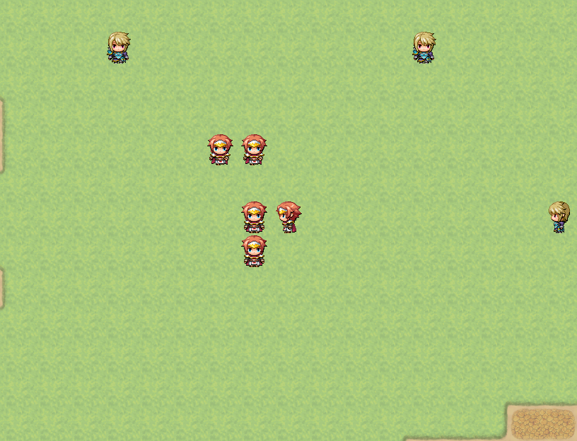

# Tween Picture



이 RPG Maker MV 플러그인은 단순히 픽쳐의 이동과 톤 변경에 Easing을 추가합니다.

[전설의 나무 키우기](http://galtgame.com)을 만들 때 Tween Picture를 처음 만들었고, 저장소에 올리면서 이 플러그인의 기능을 개선했습니다.

추천 MV 버전 : `1.6.2` 이상

> 이것을 사용하기 전에 https://easings.net/ko 에서 Easing이 무엇인지 알아볼 수 있습니다.

## 한계

이 플러그인은 RPG Maker의 의도와 설계의 차이로 인해 회전을 지원하지 않습니다.

## 사용법

픽쳐가 움직일 때 Easing을 적용하고 싶다면, 아래의 스크립트를 픽쳐의 이동 / 톤 변경 이벤트보다 먼저 실행되도록 하세요.

```
SetPictureEase(<픽쳐 ID>, '<Easing 타입>');
```

- `픽쳐 ID`  : Easing을 넣고 싶은 픽쳐의 ID
- `Easing 타입` : 넣고 싶은 Easing 타입

예시 : 1번 픽쳐에 Easing으로 BounceOut 사용
```js
SetPictureEase(1, 'BounceOut');
```

픽쳐의 Easing을 플러그인 기본값으로 돌리고 싶다면, 아래의 스크립트를 사용하세요.

```
SetPictureEase(<픽쳐 ID>);
```

- `픽쳐 ID` : Easing 타입을 플러그인 기본값으로 초기화 할 픽쳐의 ID

예시 : 1번 픽쳐의 Easing을 플러그인 기본값으로 초기화
```js
SetPictureEase(1);
```


아래의 스크립트를 사용해서 픽쳐에 흔들림 효과를 줄 수 있습니다.

```
ShakePicture(<픽쳐 ID>, <도착할 흔들림 강도>, <걸리는 시간>);
```

- `픽쳐 ID` : 흔들림 효과를 줄 픽쳐의 ID
- `도착할 흔들림 강도` : 걸리는 시간에 걸쳐 적용 할 흔들림 강도
- `걸리는 시간` : 흔들림 강도가 정해진 수치에 도달하는 데 걸릴 시간 (프레임)
> * 픽쳐의 Easing 타입에 따라 흔들림 강도가 변화합니다.  
> * 이 기능은 이벤트를 기다리지 않습니다.  
     흔들림 효과가 적용이 끝날 때까지 대기하고 싶다면, 해당 스크립트 이벤트 다음에 대기 이벤트를 걸리는 시간만큼 지정하세요.


사용 가능한 Easing 목록 :

- Linear (RPG Maker 시스템의 기본 설정)
- [QuadIn](https://easings.net/ko#easeInQuad)
- [QuadOut](https://easings.net/ko#easeOutQuad)
- [QuadInOut](https://easings.net/ko#easeInOutQuad)
- [CubicIn](https://easings.net/ko#easeInCubic)
- [CubicOut](https://easings.net/ko#easeOutCubic)
- [CubicInOut](https://easings.net/ko#easeInOutCubic)
- [QuartIn](https://easings.net/ko#easeInQuart)
- [QuartOut](https://easings.net/ko#easeOutQuart)
- [QuartInOut](https://easings.net/ko#easeInOutQuart)
- [QuintIn](https://easings.net/ko#easeInQuint)
- [QuintOut](https://easings.net/ko#easeOutQuint)
- [QuintInOut](https://easings.net/ko#easeInOutQuint)
- [SineIn](https://easings.net/ko#easeInSine)
- [SineOut](https://easings.net/ko#easeOutSine)
- [SineInOut](https://easings.net/ko#easeInOutSine)
- [BackIn](https://easings.net/ko#easeInBack)
- [BackOut](https://easings.net/ko#easeOutBack)
- [BackInOut](https://easings.net/ko#easeInOutBack)
- [CircIn](https://easings.net/ko#easeInCirc)
- [CircOut](https://easings.net/ko#easeOutCirc)
- [CircInOut](https://easings.net/ko#easeInOutCirc)
- [BounceIn](https://easings.net/ko#easeInBounce)
- [BounceOut](https://easings.net/ko#easeOutBounce)
- [BounceInOut](https://easings.net/ko#easeInOutBounce)
- [ElasticIn](https://easings.net/ko#easeInElastic)
- [ElasticOut](https://easings.net/ko#easeOutElastic)
- [ElasticInOut](https://easings.net/ko#easeInOutElastic)