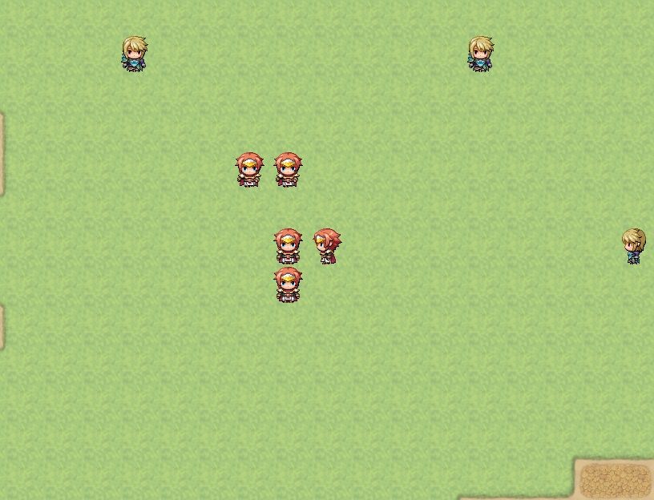

# Tween Picture



This RPG Maker MV plugin simply adds easing feature to the movement and tone changes of the Picture.

I first made it when I was making [Growing a Legendary Tree](http://galtgame.com/en.html), and I improved it as I uploaded it to the repository.  
Recommanded MV version : `1.6.2^`

> Before use this, take a look at https://easings.net for understand easing features.

## Limitation

This plugin does not support rotation due to differences in RPG Maker's intent and design.

But you can implement rotate with easing feature with `TweenPictureRotationExtension` plugin.  
For details, see [Tween Picture Rotation Extension](#tween-picture-rotation-extension).

## Usage

If you want to use easing to picture at moment, add below script event before move / change tone of picture event.

```
SetPictureEase(<Picture ID>, <Easing type>);
```

- `Picture ID`  : Picture's ID you want to add easing.
- `Easing type` : Easing type you want to apply to picture.

Example : Use Easing as BounceOut to Picture 1
```js
SetPictureEase(1, 'BounceOut');
```

If you want to reset easing to default easing type of picture, add below script event.

```
SetPictureEase(<Picture ID>);
```

- `Picture ID` : Picture's ID you want to reset easing type.

Example : Reset Easing to plugin's default type to Picture 1
```js
SetPictureEase(1);
```


You can use shake effect to picture with this.

```
ShakePicture(<Picture ID>, <Destination amount>, <Duration>);
```

- `Picture ID` : Picture's ID you want to take shake effect.
- `Destination amount` : Shake amount you want to finish duration.
- `Duration` : Duration (frames) of shake effect will take to finish.
> * Destination amount will applied by easing type.  
> * This doesn't wait event.  
     If you want to wait until finish this effect, add delay event after this script event.

Example : Apply shake intensity of 10 to Picture 1 over 60 frames
```js
ShakePicture(1, 10, 60);
```


Available ease list :

- Linear (Default easing of RPG Maker system)
- [QuadIn](https://easings.net/#easeInQuad)
- [QuadOut](https://easings.net/#easeOutQuad)
- [QuadInOut](https://easings.net/#easeInOutQuad)
- [CubicIn](https://easings.net/#easeInCubic)
- [CubicOut](https://easings.net/#easeOutCubic)
- [CubicInOut](https://easings.net/#easeInOutCubic)
- [QuartIn](https://easings.net/#easeInQuart)
- [QuartOut](https://easings.net/#easeOutQuart)
- [QuartInOut](https://easings.net/#easeInOutQuart)
- [QuintIn](https://easings.net/#easeInQuint)
- [QuintOut](https://easings.net/#easeOutQuint)
- [QuintInOut](https://easings.net/#easeInOutQuint)
- [SineIn](https://easings.net/#easeInSine)
- [SineOut](https://easings.net/#easeOutSine)
- [SineInOut](https://easings.net/#easeInOutSine)
- [BackIn](https://easings.net/#easeInBack)
- [BackOut](https://easings.net/#easeOutBack)
- [BackInOut](https://easings.net/#easeInOutBack)
- [CircIn](https://easings.net/#easeInCirc)
- [CircOut](https://easings.net/#easeOutCirc)
- [CircInOut](https://easings.net/#easeInOutCirc)
- [BounceIn](https://easings.net/#easeInBounce)
- [BounceOut](https://easings.net/#easeOutBounce)
- [BounceInOut](https://easings.net/#easeInOutBounce)
- [ElasticIn](https://easings.net/#easeInElastic)
- [ElasticOut](https://easings.net/#easeOutElastic)
- [ElasticInOut](https://easings.net/#easeInOutElastic)

---

# Tween Picture Rotation Extension


This plugin is addon for `TweenPicture.js` that adds animate rotation feature.

## Limitation

This plugin may not be compatible with third party plugins that rotate pictures.

## Usage

You must place this below `TweenPicture` plugin.

> * All movements available here are applied to the Tween Picture's easing effect.
> * All functions of this plugin do not wait for events.  
>   If you want to wait for the rotation animation to finish,
>   specify a wait event after every rotation script event
>   for as long as it takes.

Basic usage is simple, add below script event to rotate picture.

```
RotatePicture(<Picture ID>, <Degree>, <Duration>);
```

- `Picture ID` : Picture's ID you want to rotate.
- `Degree` : Destination degree of rotation.
- `Duration` : Duration (frames) of rotation move.  
  Set `0` to rotate immediately.

Note that, basic rotation is moves to closest way to target degree.  
It never rotates over 180 degree way.

Example : Rotate to -45 degree to picture 1.  
(It'll be 315 degree.)
```js
RotatePicture(1, -45, 60);
```

You can use this instead to rotate the arrival degree by its absolute value.

```
RotatePictureFixed(<Picture ID>, <Degree>, <Duration>);
```

- `Picture ID` : Picture's ID you want to rotate.
- `Degree` : Destination degree of rotation. (absolute)
- `Duration` : Duration (frames) of rotation move.  
  Set `0` to rotate immediately.

Using this will unconditionally rotate the picture from the current degree value to target degree value.

For example, when the picture is at 0 degrees, using 1080 (360 x 3) will make it rotate 3 times.

Example : Rotate picture 1 by 1080 degrees for make it rotates 3 times.  
(Rotates 1080 degrees from the current degree of the picture)

```js
RotatePictureFixed(1, 1080, 300);
```